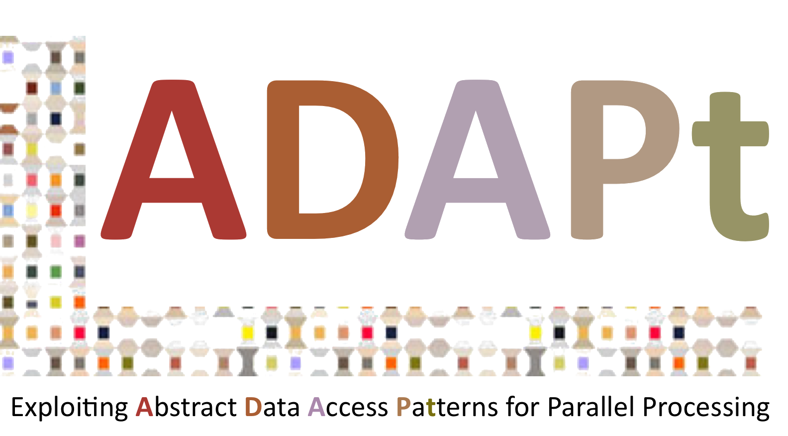

<!--
# Welcome to ICTAC 2023!

The 20th International Colloquium on Theoretical Aspects of Computing will
take place in Lima - Peru, on 04-08 December 2023. ICTAC 2023 will be
hosted by UTEC, Lima - Peru.
 -->

# Call for Papers

TBD

### Important dates

TBD

### Invited Speakers

TBD

# About ICTAC

The aim of the colloquium is to bring together practitioners and researchers from academia, industry and government to present research results, and exchange experience, ideas, and solutions for their problems in theoretical aspects of computing. Beyond these scholarly goals, another main purpose of the conference is to promote cooperation in research and education between participants and their institutions, from developing and industrial countries.

### Past Editions

- [ICTAC 2021](https://viam.science.tsu.ge/clas2022/ictac/index.html){:target="_blank"}, Tbilisi, Georgia, September 27-30, 2022

# Support

{:style="text-align:center;"}
{:target="blank"}
{:target="blank"}

